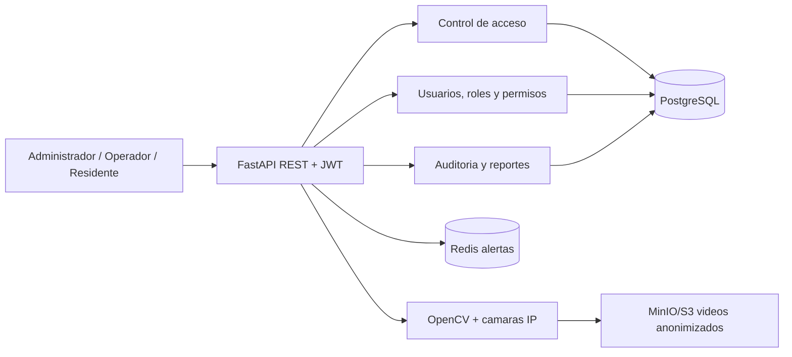

# NEXA

NEXA es una base modular para gestion de accesos, videovigilancia, alertas y reportes en conjuntos residenciales colombianos. El MVP usa FastAPI, PostgreSQL, Redis, MinIO, JWT/OAuth2 y OpenCV.

## Variables de PostgreSQL/Railway

Configura `DATABASE_URL` en Railway usando la referencia de variable de tu servicio PostgreSQL, por ejemplo `${{Postgres.DATABASE_URL}}`; nunca pegues la contraseña directamente en el repositorio. Después ejecuta [database/schema.sql](database/schema.sql) una vez contra la base para crear tablas, índices, vistas y funciones. La aplicación convierte automáticamente URLs `postgres://` y `postgresql://` al driver `psycopg`.

## Inicio local

1. Copia `.env.example` a `.env` y cambia `SECRET_KEY`.
2. Ejecuta `docker compose up --build`.
3. Abre `http://localhost:8000/docs` para Swagger y `http://localhost:9001` para MinIO.
4. Ejecuta el script [database/schema.sql](database/schema.sql) sobre PostgreSQL para crear tablas, vistas, índices y particiones.
5. Importa [postman/NEXA.postman_collection.json](postman/NEXA.postman_collection.json) en Postman.

### Interfaz Angular

El frontend está en [frontend](frontend) y usa Angular 19 standalone, TypeScript, SCSS y `HttpClient`.

```powershell
cd frontend
npm install
npm start
```

Abre `http://localhost:4200`. El dashboard funciona con datos demostrativos y el indicador **Modo demostración** consulta `/health` al hacer clic; cuando FastAPI esté activo cambia a **API conectada**. Para producción: `npm run build` genera `frontend/dist/frontend`.

## Arquitectura



## Endpoints

| Metodo | URL | Uso |
|---|---|---|
| GET | `/health` | Estado del servicio |
| POST | `/api/auth/register` | Registrar usuario con consentimiento |
| POST | `/api/auth/login` | Obtener JWT |
| POST | `/api/auth/refresh` | Renovar JWT |
| GET/PATCH | `/api/users`, `/api/users/{id}/status` | Administrar usuarios |
| GET/POST | `/api/accesos` | Registrar y consultar accesos |
| GET/POST/PATCH | `/api/alertas` | Gestionar alertas |
| GET | `/api/cameras`, `/api/cameras/{id}/stream` | Operar videovigilancia |
| GET | `/api/reportes/access-summary` | Resumen de accesos |
| GET | `/api/auditoria` | Consulta restringida de trazabilidad |

## Requisitos funcionales

La matriz completa está en [requirements/nexa_requisitos.csv](requirements/nexa_requisitos.csv), con una vista compatible con Excel en [requirements/nexa_requisitos.xml](requirements/nexa_requisitos.xml). Contiene 26 RF con módulo, prioridad y trazabilidad normativa. Para producir un `.xlsx` nativo ejecuta `pip install openpyxl` y `python scripts/generar_excel.py`.

## Cumplimiento

- **Ley 1581 de 2012:** consentimiento explícito, minimización, roles, bcrypt, JWT, auditoría, fechas de retención y mecanismos previstos para consulta/rectificación.
- **Circular 005 de 2017:** cámaras con finalidad y ubicación registradas, acceso restringido, anonimización de rostros, retención configurable y trazabilidad de evidencias.
- En producción: HTTPS obligatorio, secretos fuera del repositorio, MFA para administradores, cifrado de backups, revisión legal de plazos de retención y procedimiento formal de atención de titulares.

## Seguridad y operación

`app/services/face_anonymizer.py` aplica blur con Haar Cascade a los rostros detectados antes de publicar un video. `scripts/backup.py` genera dumps custom de PostgreSQL y debe programarse con cron o un job administrado. Para producción se recomienda mover usuarios y accesos del almacenamiento demo en memoria a repositorios SQLAlchemy, activar WebSockets para alertas y usar credenciales IAM de mínimo privilegio para S3.

## Validación

Con Python instalado: `pip install -r requirements.txt`, `pytest` y `uvicorn app.main:app --reload`. La colección Postman incluye login, refresh, CRUD básico, stream y la regla de rechazo a usuarios inactivos.
